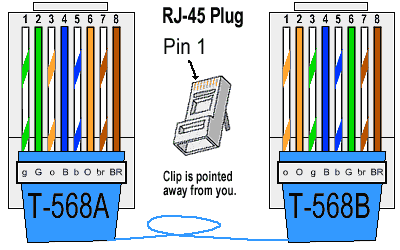

# Electric Standard
- [Electric Standard](#electric-standard)
  - [Low Current connectors and wire (\<1A)](#low-current-connectors-and-wire-1a)
    - [Conventions](#conventions)
      - [Color Code](#color-code)
  - [High Current connectors and wire (\> 1A)](#high-current-connectors-and-wire--1a)
      - [Color Code](#color-code-1)
    - [Connectors](#connectors)
    - [Wires](#wires)

## Low Current connectors and wire (<1A)

RJ45 connectors and ethernet cables are preferred for every low current application. Low current application basically refers to every logic data circuit. For example, signal from microcontrollers GPIOs or low current alimentation circuit.

### Conventions

We'll always use the T-568B wire convention but it isn't necessary for our use. The following picture shows the pinout with the clip facing away from you (see picture).

    

Below is the rovus custom PINOUT that should be respected as much as possible*:

    - 1 -> CAN_H
    - 2 -> CAN_L
    - 3 -> GPIO signal (MAX 3.3V)
    - 4 -> GPIO signal (MAX 3.3V)
    - 5 -> GPIO signal (MAX 3.3V)
    - 6 -> GPIO signal (MAX 3.3V)
    - 7 -> VCC (according to color code) (24V, 12V, 5V, 3.3V)
    - 8 -> GND

*If needed, you can overwrite the convention but only if you use RED ethernet cables with the custom pinout p-touched and clearly identified at both ends of the wire.

#### Color Code

    - RED = Regulated* 24V
    - YELLOW = 12V
    - BLUE = 5V
    - GREEN = 3.3V
    - BLACK = Regular Ethernet

*24V Ethernet should only be POE injected and used as networking cables.

## High Current connectors and wire (> 1A)

#### Color Code
    - RED = Unregulated 24V
    - YELLOW = Regulated 12V
    - BLUE = Regulated 5V
    - GREEN = Regulated 3.3V

*If needed, you can overwrite the convention but only if you use BLACK cables assemblies and p-touched clearly identified at both ends of the wire.

### Connectors

Follow this table to choose the correct connector

| Max Current | Connector Type |
|-------------|----------------|
| <30         | XT-30          |
| 30-60       | XT-60          |
| 60-90       | XT-90          |
| 90-120      | EC5            |
| Don't       | QS8-S          |

For voltages exceeding about 18V please try to use spark proof connectors. They are often identified by a green mark on XT-* or a red mark on QS8-S.

### Wires

Always choose a wire gauge corresponding to the amount of current your circuit is drawing to meet the CIRC rules.
