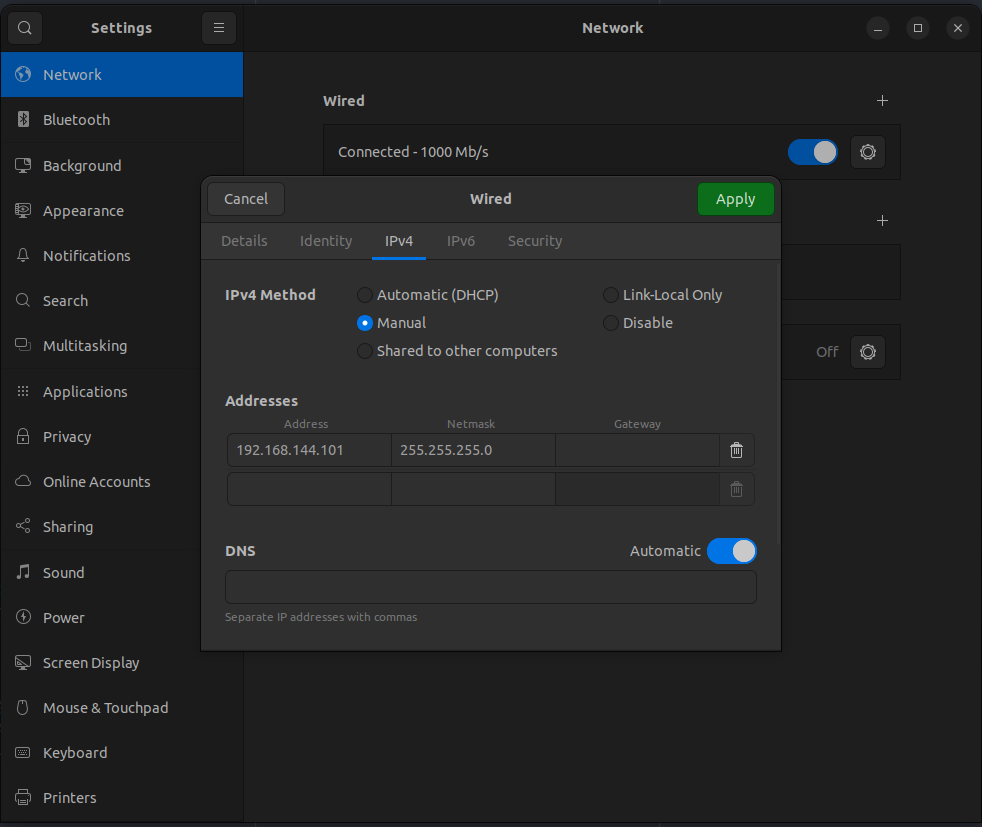

# Network Configuration

Here you will find the ip addresses and login info of each antenna as well as all the used IP addresses for all components.

## IP address table

The rover is on the 192.168.144.0/24

Personal computers must be on IP addresses between 192.168.144.100 and  192.168.144.254.

This is a table of all IP addresses used.

| IP address         | Device              |
|--------------------|---------------------|
| 192.168.144.20     | Main Rover PC (MCU) |
| 192.168.144.25     | Camera R1M 1        |
| 192.168.144.26     | Camera R1M 2        |
| 192.168.144.50     | M2.4 Rover          |
| 192.168.144.55     | M2.4 Base station   |
| 192.168.144.60     | ESP32 antenna PCB   |
|                    |                     |
| **Personal PC IP** | **Name**            |
| 192.168.144.101    | Philippe Michaud    |
| Add your IP here   |                     |

The ROS_DOMAIN_ID must be 69 on all computers :

```bash
export ROS_DOMAIN_ID=69
```

## Antennas

The user and password for all antennas is *rovus*.

### Rocket M2

* IP rover (Rover M2): 192.168.144.50
* IP base station (Base M2): 192.168.144.55
* SSID : rovusM2

Web Interface:
* Username: rovus
* Password: rovus

### Rocket M900 (old, but relevant if needed)

* IP rover (Rover M900) : 192.168.143.50 (Rick)
* IP base station (Base M900) : 192.168.143.55 (Morty)
* SSID : rovusM900
  
Web Interface:
* Username: rovus
* Password: rovus

### Connecting to the network
* Plug in the 2.4Ghz ethernet cable into your computer
* Set up your network like this:
  * Open ubuntu settings
  * Go to the *network tab*
  * Under wired, click the *gear* button
  * Go to the *IPv4 tab*
  * Set *IPv4 Method* to *Manual*
  * Enter these settings under addresses:
    * Address: 192.168.144.* (* should be between 100 and 255 and be reserved in the [IP address table](#IP-address-table))
    * Netmask: 255.255.255.0
    * Gateway: Leave empty

  * Reset the network interface (set to off than to on)
    * To check if the new config was applied, enter this command in a terminal:
    * ```ifconfig | grep <ENTER ADDRESS> ```
    * If a line like this: ```inet <YOUR IP> netmask:255.255.255.0 ...``` apers, your all set.

* When using USB to Ethernet adapters, you'll need to make the configuration for each different adapters
* You should now able to ping other devices on the network.

### Wireless Setup
**Des problèmes ont été observé avec le router lorsque plusieurs messages ROS sont envoyés. L'usage de la connection wireless est flaky.**

Il est possible de se connecter au Rover sans sortir l'antenne de la base station, très pratique pour des tests à courtes portées. Il y a un router en mode lan repeter dans le rover qui émet un réseaux wifi qui permet d'accèder au réseaux local du rover (M2.4, MCU, Cams, etc.)

Information de connections:

* Interface de configuration du router
  * password: rover

* Réseau wifi
  * SSID: rovus_low_range
  * password: roverrover
