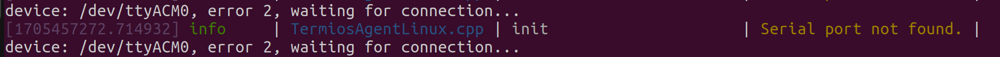

# Rovus micro controllers projects

This repo contains all microcontroller projects of the rovus team. **Warning: this repo cannot be cloned inside your ros2_ws since it contains MicroRos code.**

## Table of content

- [Rovus micro controllers projects](#rovus-micro-controllers-projects)
  - [Table of content](#table-of-content)
  - [General guidelines](#general-guidelines)
    - [Folder structure](#folder-structure)
    - [Development board buying guide](#development-board-buying-guide)
  - [None MicroRos project (preferred)](#none-microros-project-preferred)
    - [Platformio.ini](#platformioini)
      - [Platformio.ini ESP32-S2 (Development board)](#platformioini-esp32-s2-development-board)
      - [Platformio.ini ESP32-S3 (Custom PCB)](#platformioini-esp32-s3-custom-pcb)
    - [Development](#development)
      - [lib\_rover](#lib_rover)
      - [rover\_can\_lib](#rover_can_lib)
  - [ESP32 MicroRos (last resort)](#esp32-microros-last-resort)
    - [Guidelines](#guidelines)
    - [MicroRos Setup](#microros-setup)
    - [platformio.ini](#platformioini-1)
    - [Creating a new project](#creating-a-new-project)
    - [Connecting the ESP to the ROS network](#connecting-the-esp-to-the-ros-network)
    - [Logging](#logging)
      - [Usage](#usage)
    - [Including custom msgs from rover\_msgs package](#including-custom-msgs-from-rover_msgs-package)
    - [Platformio project folder structure example](#platformio-project-folder-structure-example)

## General guidelines

- Don't use MicroRos if possible.
- Use ESP32-* for all microcontrollers projects
- Develop in VSCode with platformIO
- Run your serial ports at 115200 baud
- Limit dynamic allocation and follow embedded coding guidelines as much as you can ([see our coding guidelines](../how_to/coding%20guidelines.md))

### Folder structure

```bash
└── rover_micro/
    ├── project0
    ├── project1
    ├── project2
    ├── project2
    ├── project3
    ├── ...
    ├── templates # Used to be more relevant when using MicroROS 
    └── lib/
        ├── lib_rover # helpers
        ├── rover_can_lib # canbus
        └── rover_micro_ros_lib # Used to be more relevant when using MicroROS 
```

### Development board buying guide

When buying ESP32 or any microcontrollers, make sure it comes with a unique USB ID. The "usb to UART bridge" chip on the board should take care of this but some cheap chips all have the same id. This make identifying which board is which quite hard and has caused problem in the past.

- Safe bets:
  - CH9102X
- To avoid:
  - CP2102*
  - CH430

To order: <https://fr.aliexpress.com/item/1005005906529113.html>

Here is an example of a bad FTDI chip (CP2102N):


## None MicroRos project (preferred)

Most microcontroller are installed on the rover to control actuators or to interface and handle sensors. They will (on the rover) always communicated between the main computer and each other by CanBus (see main rover repo for protocol documentation).

At the current time there's are only ESP32-S3 (On custom PCB) and ESP32-S2 (On development board). They have some slight difference in platformio.ini config but are fairely the same to work with.

### Platformio.ini

#### Platformio.ini ESP32-S2 (Development board)

```INI
[env:esp32-s3]
platform = https://github.com/Jason2866/platform-espressif32.git
board = nodemcu-32s
framework = arduino
monitor_speed = 115200
monitor_raw = true

lib_deps = 
    rover_can_lib=symlink://../lib/rover_can_lib
    lib_rover=symlink://../lib/lib_rover

build_unflags =
    ; Shows more warning messages when compiling and make sure code is compiling
    ; with c++ version 2020. (required for rover_can_lib)
    -w CCFLAGS
    -std=gnu++11

build_flags = 
  -Wall
  -Wextra

  ; Logging
  '-D VERBOSE=0'
  '-D LOGGER_LOWEST_LEVEL=0'
```

#### Platformio.ini ESP32-S3 (Custom PCB)

This file contains your [platformio project configuration](https://docs.platformio.org/en/latest/projectconf/index.html). For rover projects, your configuration will need to include at least the following elements:

```INI
[env:esp32-s3-devkitc-1]
platform = espressif32
board = esp32-s3-devkitc-1
framework = arduino

monitor_speed = 115200
monitor_raw = true

lib_deps = 
    rover_can_lib=symlink://../lib/rover_can_lib
    lib_rover=symlink://../lib/lib_rover

build_unflags =
    ; Shows more warning messages when compiling and make sure code is compiling
    ; with c++ version 2020. (required for rover_can_lib)
    -w CCFLAGS
    -std=gnu++11

build_flags =
    -Wall
    -Wextra

    ; Make sure to use the internal USB driver on the ESP32-S3 instead of a
    ; standard UART interface 
    '-D ARDUINO_USB_CDC_ON_BOOT=1'
    '-D ARDUINO_USB_MODE=1'

    ; Logging
    '-D VERBOSE'
    '-D LOGGER_LOWEST_LEVEL=0'
```

### Development

At this time there are no available starting templates for non MicroRos project but they are simpler to work with, so we advise to just copy and paste another project and start from there (The "propulsion_motor" project is suggested). All code that can be reused is located inside the "lib_rover library".

#### lib_rover

This library is split in multiple scoped libraries;

```bash
lib/
  ├── lib_rover/
  │   └── include/
  │       ├── actuators/
  │       │   └── ...
  │       ├── sensors/
  │       │   └── ...
  │       ├── systems/
  │       │   └── ...
  │       └── rover_helpers/
  │           └── ...
  ├── rover_can_lib
  └── rover_micro_ros_lib
```

- Actuators
  - This is where code for motor drivers, servo motors, linear actuators, etc. is located
- Sensors
  - This is where code for encoders, TOF sensors, imus, gps, magnetometer, etc. is located
- Systems
  - This is where systems are located. For example: a "revolute joint" system would be composed of actuators and sensors. Systems can also include other system, for example a "robotic arm" system could be composed of multiple "revolute joint" systems.
- Rover_helpers
  - Includes multiple simple classes to help development and aid with code readability and consistency (between project). It includes, but is not limited to;
    - A Timer for constant* loop interval
    - A Chrono for time measurement
    - Led Blinkers for making led pattern easily (software and hardware version available)
    - A Logger which is similar to the ROS logging mechanisms
    - Macros of all sorts (see code as documentation)
    - A Moving Average (low pass filter with constant coefficients)
    - A PID class
    - Some Assertion macros

All code which can be reused should be added to the lib and not be local to projects. If they only work for certain microcontrollers, include guards should be used to prevent usage with wrong microcontrollers. Try to always use existing helpers/drivers instead of writing your own version (improve them if necessary), or create some if they don't exist yet.

#### rover_can_lib

This library is the same as the linux x86 version. [See the documentation on the main rover repo](https://github.com/robotique-udes/rover/tree/release/circ2024/doc/can). When making modifications, you need to manually copy those modifications to the rover repo (copy/pasting the folder does it).

## ESP32 MicroRos (last resort)

### Guidelines

- DON'T use spaces in platformIO project names (this will cause issues with micro_ros_platformio (see [#119](https://github.com/micro-ROS/micro_ros_platformio/issues/119)))
- Use serial transport

### MicroRos Setup

Since were running ROS2, some microcontrollers might run [microROS](https://micro.ros.org/) and all development will be in platformIO. This [tutorial](https://www.youtube.com/watch?v=Nf7HP9y6Ovo) is a great first step at learning microROS. Those are the steps from the tutorial you should do:

```bash
# You should always work in your ros2_ws
cd ~/ros2_ws
git clone -b humble https://github.com/micro-ROS/micro_ros_setup.git src/micro_ros_setup

# Update dependencies using rosdep
sudo apt update && rosdep update
rosdep install --from-paths src --ignore-src -y

# Install pip
sudo apt-get install python3-pip

# Build micro-ROS tools and source them
colcon build
source install/local_setup.bash
```

Then you need to install micro-ros Agent:

```bash
# Download packages
ros2 run micro_ros_setup create_agent_ws.sh

# Build
ros2 run micro_ros_setup build_agent.sh
source install/local_setup.bash
```

You can test your setup by running the micro-ROS agent:

```bash
ros2 run micro_ros_agent micro_ros_agent serial --dev /dev/ttyACM0
```

This should be the result when no micro-controller are plugged-in:



### platformio.ini

This file contains your [platformio project configuration](https://docs.platformio.org/en/latest/projectconf/index.html). For rover projects, your configuration will need to include at least the following elements:

```INI
[env:nodemcu-32s]
; PLatformIO doesn't directly support our cheap ESP32, this git repo fix this
platform = https://github.com/Jason2866/platform-espressif32.git
framework = arduino
board = nodemcu-32s

monitor_speed = 115200 ; monitor baud rate
monitor_raw = true ; allow colors inside terminal

; microros config
board_microros_transport = serial 
board_microros_distro = humble

; libraries
lib_deps = 
    rover_lib=symlink://../lib_rover
    https://github.com/micro-ROS/micro_ros_platformio.git

; Act as #define CONSTANT 
build_flags = 
    ; When defined, LOG() macro are compiled, otherwise it's skipped for performance
    '-D VERBOSE'
    ; Only shows higher logs levels. Levels are: DEBUG=10, INFO=20, WARN=30, ERROR=40, FATAL=50
    '-D LOGGER_LOWEST_LEVEL=20'
    ; Do not change this is used for the debug_printer.cpp(terminal_logger.py)
    '-D NAME_LOG_TOPIC="/debug/rovus_debug"'
```

The ESP32 we currently own are cheap dev boards and they don't work out of the box with platformio. To fix this, modify this line in your platformio.ini file:

```INI
platform = https://github.com/Jason2866/platform-espressif32.git
```

### Creating a new project

To create a project, start by copying the [rover/rover_micro_projects/esp32_template](/esp32_template/) project. This is a ready to used platformio project for ESP32 which includes our custom [logging mechanism](logging) (prints) and our custom connection manager. Don't hesitate to add new features to the template.

### Connecting the ESP to the ROS network

Once the code uploaded inside the micro controller, you need to connect it to the ROS network to link pub, sub and srv. To do this you need to start a micro_ros_agent node. To start one, run in a new terminal:

```bash
ros2 run micro_ros_agent micro_ros_agent serial --dev /dev/ttyUSB0
```

The "--dev /dev/*" argument needs to match with the usb id of your ESP32. To know its id, run the following in a terminal:

```bash
ls /dev/tty*
```

You should see a file named /dev/ttyUSB*or /dev/ttyACM* (the star is a number indexed at 0). This a universal id for any USB device and can be used when only one device is plugged in.

If multiple devices are connected your computer, you'll need the unique ID of your controller. This can be accessed by entering the following cmd in a terminal:

```bash
ls /dev/serial/by-id/
usb-Silicon_Labs_CP2102_USB_to_UART_Bridge_Controller_0001-if00-port0
```

This ID can then be used when launching the micro_ros_agent:

```bash
ros2 run micro_ros_agent micro_ros_agent serial --dev /dev/serial/by-id/usb-Silicon_Labs_CP2102_USB_to_UART_Bridge_Controller_0001-if00-port0
```

### Logging

microROS doesn't really support any logger out of the box. This isn't great since we'll want to print informations to the screen. We unfortunatly can't use the serial monitor since microROS already talks over Serial to the micro_ros_agent.
This is why we created a custom logger that use a publisher/subscriber mecanism to print to the screen.

#### Usage

Inside your ESP32 project, you'll need to call the Logger.createLogger() when creating your entities and the Logger.destroyLogger() when destroying your entities ([refer to the template](/esp32_template/src/main.cpp)).

Usage example:

```cpp
LOG(INFO, "some_text %i", some_int);
```

The INFO set the logging level, options are DEBUG-INFO-WARN-ERROR-FATAL

To see your prints, you MUST launch the terminal_logger.py launchfile inside the rover_helper pkg:

```bash
ros2 launch rover_helper terminal_logger.py
```

If you are connected to the ROS network, all print will be sent over to your computer by the ROS network and will show up inside the terminal_logger terminal. If for some reason your are not connected to the ROS network, your logs will be printed to the normal platformio serial monitor.

### Including custom msgs from rover_msgs package

To include custom msgs definitions from the rover_msgs package, follow these steps:

  1. Copy the up to date "rover_msgs" folder from ros2_ws/rover/<rover_msgs> inside the <project-name>/extra_package/ folder.
  2. delete the .pio folder
  3. open the "platformio.ini file
  4. ctrl+s to force a rebuild of the .pio folder
  5. Wait (it's a long wait)

### Platformio project folder structure example

```bash
esp32_template
├── extra_packages
│   └── rover_msgs

├── platformio.ini
└── src
    └── main.cpp
```
