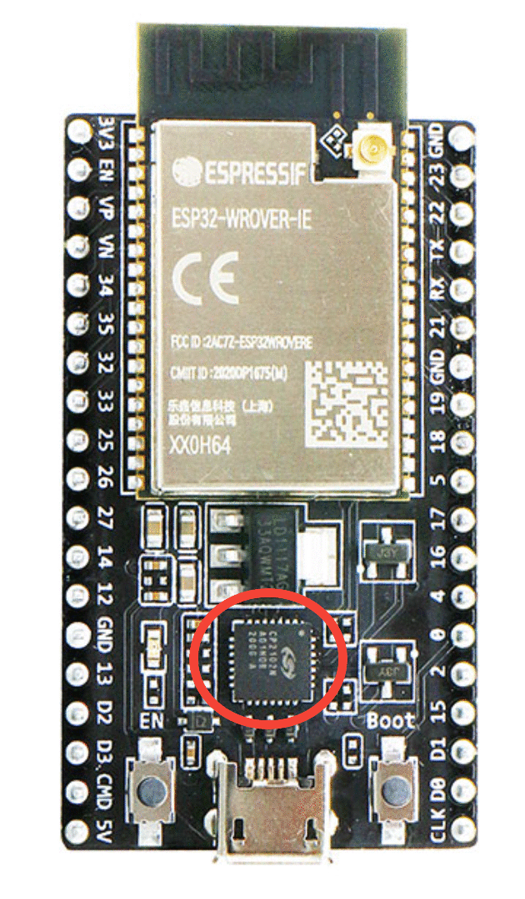

# Micro controllers projects

## Table of content
- [ESP32 Setup](#esp32-setup)
  - [General guidelines](#general-guidelines)
  - [platformio.ini](#platformio.ini)
  - [Buying guide](#buying-guide)
- [Creating a new project](#creating-a-new-project)
- [Connecting the ESP to the ROS network](#connecting-the-esp-to-the-ros-network)
- [Logging](#logging)
  - [Usage](#usage)

## ESP32 Setup
Since were running ROS2, all microcontrollers will run [microROS](https://micro.ros.org/) and all developpement will be in platformIO. This [tutorial](https://www.youtube.com/watch?v=Nf7HP9y6Ovo&t=435s) is a great first step at learning microROS.
### General guidelines
 - Use ESP32 for all microcontrollers projects
 - Develop in VSCode with platformIO
 - DON'T use spaces in platformIO project names (this will cause issues with micro_ros_platformio (see [#119](https://github.com/micro-ROS/micro_ros_platformio/issues/119)) 
 - Use serial transport
 - Run your serial ports at 115200 baud
 - Add your project to rover_micro_projects
 - Define all classes/functions/macro/etc that can be reused in the rover_micro_projects/lib_rover/ to limit copy/paste between projects
 - Limit dynamic allocation and follow embedded coding guidelines as much as you can

### platformio.ini
This file contains your [platformio project configuration](https://docs.platformio.org/en/latest/projectconf/index.html). For rover projects, your configuration will need to include at least the following elements:
```INI
[env:nodemcu-32s]
; PLatformIO doesn't directly support our cheap ESP32, this git repo fix this
platform = https://github.com/Jason2866/platform-espressif32.git
framework = arduino
board = nodemcu-32s

monitor_speed = 115200 ; monitor baud rate
monitor_raw = true ; allow colors inside terminal

; microros config
board_microros_transport = serial 
board_microros_distro = humble

; librairies
lib_deps = 
    rover_lib=symlink://../lib_rover
    https://github.com/micro-ROS/micro_ros_platformio.git

; Act as #define CONSTANT 
build_flags = 
    ; When defined, LOG() macro are compilated, otherwise it's skip for performance
	'-D VERBOSE'
    ; Only shows higher logs levels. Levels are: DEBUG=10, INFO=20, WARN=30, ERROR=40, FATAL=50
    '-D LOGGER_LOWEST_LEVEL=20'
    ; Do not change this is used for the debug_printer.cpp(terminal_logger.py)
    '-D NAME_LOG_TOPIC="/debug/rovus_debug"'
```

The ESP32 we currently own are cheap dev boards and they don't work out of the box with platformio. To fix this, modify this line in your platformio.ini file:
```INI
platform = https://github.com/Jason2866/platform-espressif32.git
```

### Buying guide
When buying ESP32 or any microcontrollers, make sure it comes with a unique USB ID. The "usb to UART bridge" chip on the board should take care of this but some cheap chips all have the same id. This make identifying which board is which quite hard and has caused problem in the past.
- Safe bets:
  - CH9102X
- To avoid:
  - CP2102 
  - CH430

Here is an example of a good FTDI chip (CP2102N):



## Creating a new project
To create a project, start by copying the [rover/rover_micro_projects/esp32_template](/esp32_template/) project. This is a ready to used platformio project for ESP32 which includes our custom [logging mecanism](logging) (prints) and our custom connection manager. Don't hesite to add new features to the template. 

## Connecting the ESP to the ROS network
Once the code uploaded inside the micro controller, you need to connect it to the ROS network to link pub, sub and srvs. To do this we need to start a micro_ros_agent node. To start one, run in a new terminal:
```bash
ros2 run micro_ros_agent micro_ros_agent serial --dev /dev/ttyUSB0
```
The "--dev /dev/*" argument needs to match with the usb id of your ESP32. To know its id, run the following in a terminal:
```bash
ls /dev/tty*
``` 
You should see a file named /dev/ttyUSB* or /dev/ttyACM* (the star is a number indexed at 0). This a universal id for any USB device and can be used when only one device is plugged in.

If multiple devices are connected your computer, you'll need the unique ID of your controller. This can be accessed by entering the following cmd in a terminal:
```bash
ls /dev/serial/by-id/
usb-Silicon_Labs_CP2102_USB_to_UART_Bridge_Controller_0001-if00-port0
```

This ID can then be used when launching the micro_ros_agent:
```bash
ros2 run micro_ros_agent micro_ros_agent serial --dev /dev/serial/by-id/usb-Silicon_Labs_CP2102_USB_to_UART_Bridge_Controller_0001-if00-port0
```

## Logging
microROS doesn't really support any logger out of the box. This isn't great since we'll want to print informations to the screen. We unfortunatly can't use the serial monitor since microROS already talks over Serial to the micro_ros_agent.
This is why we created a custom logger that use a publisher/subscriber mecanism to print to the screen.

### Usage
Inside your ESP32 project, you'll need to call the Logger.createLogger() when creating your entities and the Logger.destroyLogger() when destroying your entities ([refer to the template](/esp32_template/src/main.cpp)).

Usage example:
```cpp
LOG(INFO, "some_text %i", some_int);
```
The INFO set the logging level, options are DEBUG-INFO-WARN-ERROR-FATAL

To see your prints, you MUST launch the terminal_logger.py launchfile inside the rover_helper pkg:
```bash
ros2 launch rover_helper terminal_logger.py
```
If you are connected to the ROS network, all print will be sent over to your computer by the ROS network and will show up inside the terminal_logger terminal. If for some reason your are not connected to the ROS network, your logs will be printed to the normal platformio serial monitor.
